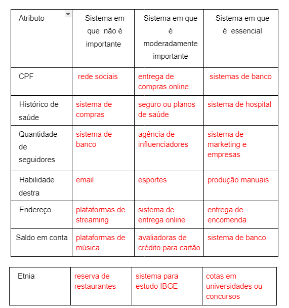

# POO 2024.2

**1. Explique com suas palavras a diferença entre uma classe e um objeto e como
esses dois conceitos se relacionam. Além disso, apresente um exemplo do mundo
real para cada um (por exemplo, usando a classe Carro e instâncias como Fusca e
Civic).

  🔴Classe é como um molde ou uma receita. Ela define como algo deve ser, quais características (atributos) e comportamentos (métodos) esse algo terá. Por exemplo, a classe Carro define que um carro tem cor, marca e ano, além de poder acelerar e frear.

Objeto é um exemplo real daquela classe. É o que você cria a partir do molde. Por exemplo, se a classe é Carro, um objeto pode ser um Fusca de cor azul ou um Civic de cor vermelha.

Exemplo do Mundo Real:

Classe: Carro
Objetos: Fusca, Civic

**2. De forma breve, conceitue atributos e métodos. Pesquise e exemplifique um
objetos ou classes que possuam atributos e métodos. Por exemplo um Carro:
• Carro
• Atributos: cor, marca, ano
• Métodos: acelerar(), frear()

Atributos são as características de um objeto. Por exemplo, um carro pode ter:

Cor: azul
Marca: Volkswagen
Ano: 2020
Métodos são as ações que um objeto pode fazer. Para um carro, os métodos podem ser:

acelerar(): faz o carro ir mais rápido.
frear(): faz o carro parar ou ir mais devagar.

**3. A abstração visa focar no que é importante para um sistema. Você concorda que
um atributo de uma pessoa pode ser importante ou não dependendo do contexto
do sistema? Enumere na tabela abaixo contextos/sistemas distintos em que os
atributos abaixo seriam relevantes:

## Imagem da Questão

**4. Considerando os objetos Pessoa e Conta:

a. Seria interessante em um sistema bancário um objeto "conta" possuir uma
"pessoa" como um atributo interno representando o titular da conta?

b. Olhando no sentido inverso, seria interessante uma pessoa possuir mais de
uma conta como atributo? Que elemento da programação estruturada melhor
representaria o conjunto de contas de uma pessoa?

  a. Sim, seria muito interessante que um objeto Conta tivesse um atributo Pessoa representando o titular da conta. Isso ajuda a relacionar diretamente a conta ao seu dono, facilitando a gestão de informações. Assim, ao acessar uma conta, podemos facilmente saber quem é o titular e suas informações.

b. Sim, seria interessante que uma Pessoa tivesse mais de uma Conta. Para representar o conjunto de contas de uma pessoa, poderíamos usar uma lista ou um array. Isso permitiria armazenar várias contas e acessar cada uma delas facilmente.

**5. Identifique pelo menos 5 objetos de um sistema de controle acadêmico. Ex: aluno.
Professor, disciplina, turma, coordenador, sala.

  
  Matrícula - relação entre o aluno e a materia
  Semestre - representa o periodo letivo que o aluno e a instituição esta
  Nota - avaliação do aluno em determinada materia   
  Curso -  conjunto de materias  
  

**6. Imagine um jogo qualquer. Identifique o máximo de objetos possíveis e eventuais
características (atributos) e comportamentos (métodos) que eles poderiam ter.
Jogo de vôlei. Atributos: duração, local, tipo, quantidade de jogadores, placar,
time1, time2. Métodos: iniciar partida, pausar, adicionar jogador, remover jogador,
finalizar partidas.

  Objetos:

Partida

Atributos:
Duração
Local
Tipo (amigável ou competição)
Placar
Time1
Time2
Métodos:
iniciar_partida()
pausar()
adicionar_jogador()
remover_jogador()
finalizar_partida()
Time

Atributos:
Nome
Jogadores (lista de jogadores)
Técnico
Métodos:
adicionar_jogador()
remover_jogador()
exibir_elenco()
Jogador

Atributos:
Nome
Número da camisa
Posição
Métodos:
servir()
atacar()
defender()
Árbitro

Atributos:
Nome
Número de identificação
Métodos:
apitar()
dar_cartão()
Placar

Atributos:
Ponto time1
Ponto time2
Métodos:
atualizar_placar()
exibir_placar()

  

